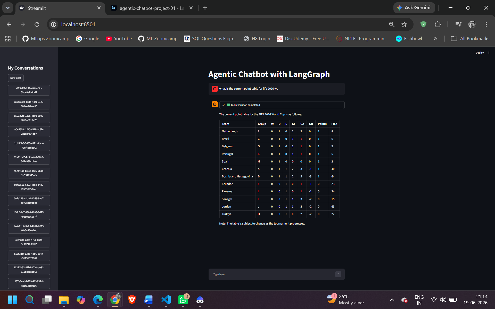
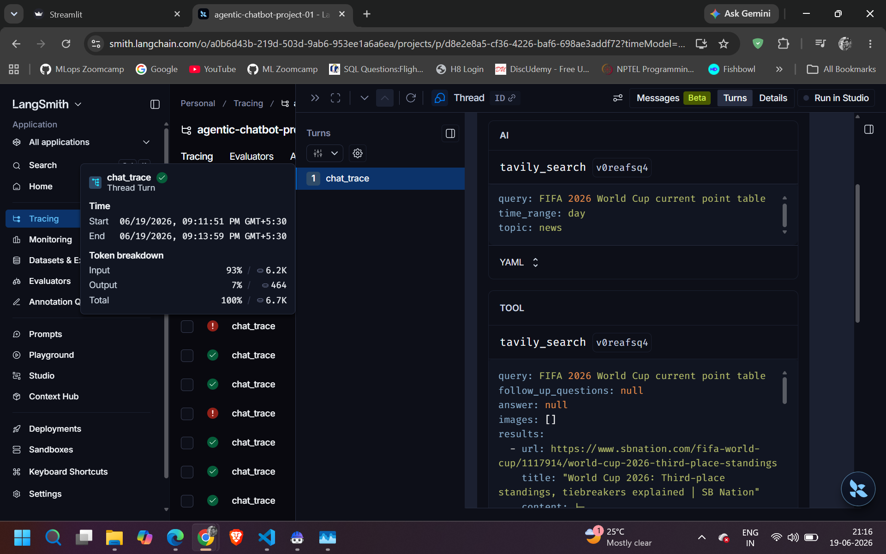

# Agentic Chatbot using LangGraph

An Agentic AI Chatbot built using LangGraph and Large Language Models (LLMs) to demonstrate intelligent conversational workflows, multi-step reasoning, state management, and context-aware interactions.

---

## Project Overview

This project demonstrates the development of an Agentic AI Chatbot using LangGraph and Large Language Models (LLMs). The solution is designed to provide intelligent conversational assistance through multi-step reasoning, workflow orchestration, and context-aware responses.

The project showcases how agentic AI systems can improve customer support and business interactions by automating information retrieval, decision-making, and conversational workflows.

---

## Architecture

The chatbot is built using:

* LangGraph for workflow orchestration
* Large Language Models (LLMs)
* Python backend services
* State management
* Context-aware conversational processing
* API-driven architecture

The system can process user requests, reason through tasks, maintain conversation state, and generate relevant responses.

---

## Application Output

The screenshot below shows the chatbot successfully processing a user query and generating a contextual response.



---

## LangGraph Workflow Tracing

LangGraph provides detailed execution tracing, allowing developers to visualize node execution, state transitions, and workflow paths. This greatly improves debugging, observability, and workflow validation.



---

## Business Problem

Organizations are increasingly adopting AI-powered customer support solutions. Traditional chatbots often struggle with:

* Limited contextual understanding
* Inability to perform multi-step reasoning
* Poor handling of complex user requests
* High dependency on human agents
* Limited scalability

This project addresses these challenges through an Agentic AI architecture capable of orchestrating multiple actions and reasoning steps.

---

## Solution Overview

The solution leverages:

* LangGraph for agent orchestration
* Large Language Models (LLMs)
* Python backend services
* API-driven architecture
* Agentic workflows
* Context management

The chatbot can process user requests, reason through tasks, and provide contextual responses.

---

## Key Features

### Agentic Workflow

* Multi-step task execution
* State management
* Decision routing
* Context preservation

### Conversational Intelligence

* Natural language understanding
* Context-aware responses
* User interaction management

### Scalable Architecture

* Modular design
* Extensible workflow framework
* API-first implementation

---

## Workflow Overview

```text
User Query
     │
     ▼
LangGraph Agent
     │
     ├── State Management
     │
     ├── Reasoning Node
     │
     ├── Decision Routing
     │
     └── Response Generation
     │
     ▼
Final Response
```

---

## Current Project Status

### Completed

* Agent workflow design
* LangGraph implementation
* Chat interface integration
* State management
* Response generation pipeline
* Backend API integration

### Current Assessment

| Category             | Score    |
| -------------------- | -------- |
| Architecture Design  | 8.5 / 10 |
| Agent Workflow       | 8.5 / 10 |
| Extensibility        | 8 / 10   |
| Scalability          | 7.5 / 10 |
| Security             | 7 / 10   |
| Monitoring           | 6 / 10   |
| Production Readiness | 7 / 10   |

**Overall Project Maturity:** 7.8 / 10

---

## Future Enhancements

### Short-Term Improvements

* Retrieval Augmented Generation (RAG)
* Vector database integration
* Session persistence
* User authentication
* Enhanced prompt engineering

### Medium-Term Improvements

* Multi-agent collaboration
* Tool calling framework
* Knowledge base integration
* Analytics dashboard
* Automated evaluation framework

### Long-Term Roadmap

* watsonx.ai integration
* watsonx.governance integration
* MCP support
* Enterprise security controls
* Human-in-the-loop approvals
* Multi-modal interactions

---

## Risks and Mitigation

### Hallucination Risk

**Mitigation**

* Grounding responses using enterprise knowledge sources
* Validation workflows
* Human review checkpoints

### Data Privacy Risk

**Mitigation**

* Role-based access controls
* Secure API communication
* Data masking
* Encryption of sensitive information

### Bias Risk

**Mitigation**

* Prompt reviews
* Human oversight
* Continuous testing
* Evaluation pipelines

---

## Business Benefits

* Improved customer experience
* Faster response times
* Reduced operational costs
* Increased scalability
* Enhanced employee productivity
* Foundation for enterprise AI adoption

---

## Technology Stack

| Component              | Technology      |
| ---------------------- | --------------- |
| Workflow Orchestration | LangGraph       |
| LLM Framework          | LangChain       |
| Language               | Python          |
| API Layer              | FastAPI / REST  |
| AI Model               | LLM             |
| State Management       | LangGraph State |

---

## Conclusion

The Agentic Chatbot project demonstrates the practical application of Agentic AI concepts using LangGraph and modern Large Language Models. The solution provides a scalable foundation for enterprise conversational AI systems while showcasing key principles of workflow orchestration, intelligent reasoning, and contextual response generation.

The project serves as a strong foundation for future enhancements including RAG, multi-agent collaboration, enterprise governance, and advanced observability capabilities.
